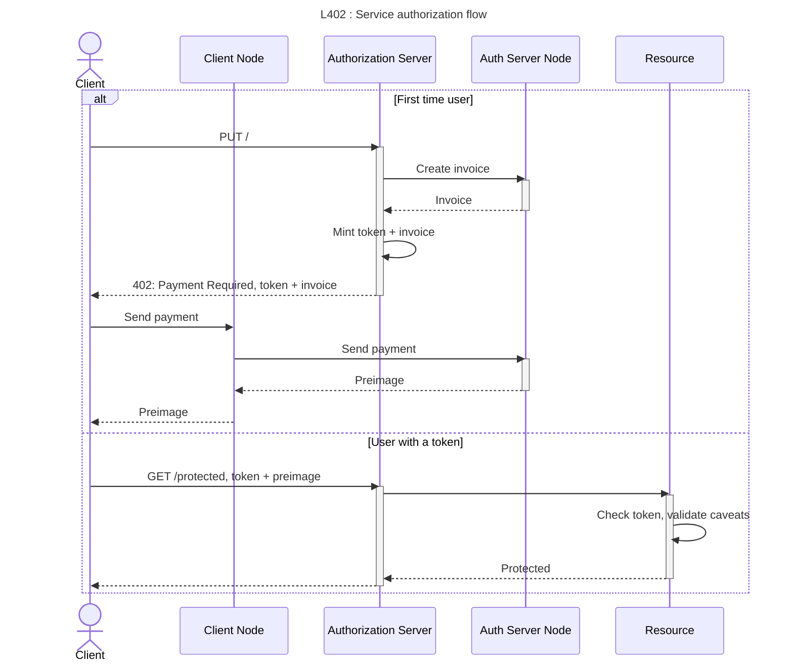

# L402

An implementation of the [L402](https://docs.lightning.engineering/the-lightning-network/l402) protocol.

## Overview

L402 is a protocol that leverages the capabilities of the Lightning Network for token minting and service authorization to enable the monetization of APIs with Bitcoin.

> [!NOTE]
> Additionally, it offers an implementation of the [phoenixd](https://phoenix.acinq.co/server) API for integration with a real Lightning node.

## Usage

This project serves as a framework for building L402-based applications. While it does not provide standalone server or client implementations, it includes essential utilities and examples to help you get started.

### Server

You can run the example server along with a `phoenixd` instance using Docker Compose. This provides a more realistic setup where the L402 server interacts with a real Lightning node.

To launch the services, run the following command:

```sh
docker-compose up
```

This will start the `phoenixd` node and the example server, which is configured to connect to it.

```sh
go run ./examples/server/server.go
```

> You need to have another running `phoenixd` instance for this to work.

### Client

In another terminal, run the following command to mint a token and access the service:

```sh
go run ./examples/client/client.go
```

## Authorization Flow

The authorization flow for L402 tokens is depicted in the following diagram:



## Resources

For more information, refer to the following resources:

- [Lightning Engineering API Documentation](https://lightning.engineering/api-docs/api/lnd/)
- [L402 Protocol Documentation](https://docs.lightning.engineering/the-lightning-network/l402)
- [Multihop Payments Documentation](https://docs.lightning.engineering/the-lightning-network/multihop-payments)

## License

This project is licensed under the terms of the [MIT License](LICENSE).
